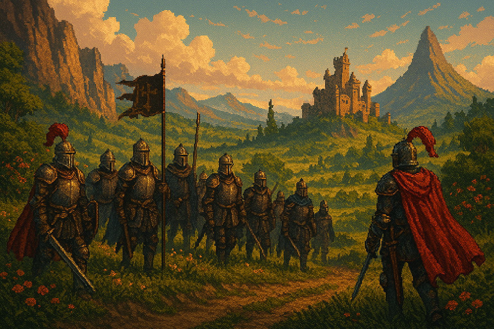
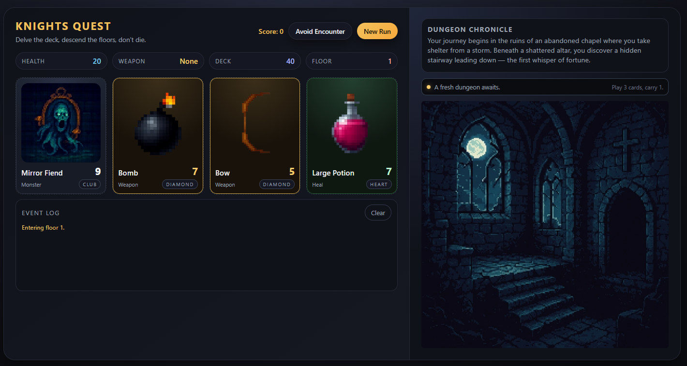
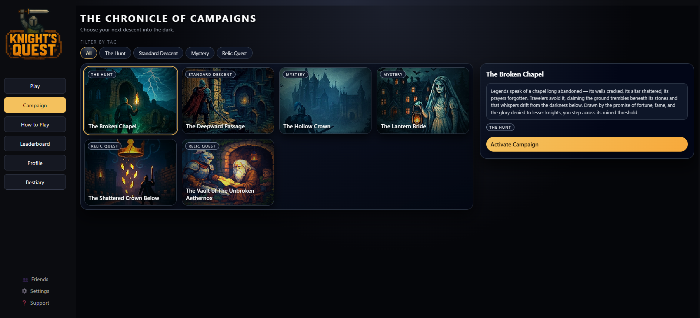

  

 

<h1 align="center">🛡️ Nicklas — Creator of Knight’s Quest</h1>

  Creative‑technical architect & indie game developer  
  Building Knight’s Quest — a handcrafted, atmospheric strategy adventure focused on clarity, fairness, and player empowerment.

---

## ⚔️ Knight’s Quest — My Life’s Work in Code

Knight’s Quest is my primary focus and the heart of my GitHub.  
Every system, every UI component, every pixel is part of building a world that feels immersive, readable, and ethically designed.

### What I’m building inside Knight’s Quest
- A clean, responsive UI with a handcrafted medieval aesthetic  
- A scalable architecture for campaigns, achievements, and progression  
- A fair, transparent ruleset with no pay‑to‑win mechanics  
- A drag‑to‑pan world map for immersive navigation  
- Modular content pipelines for future expansions and lore  

---

## 🎮 In‑Game Preview

  <!-- Add your screenshots here -->
  
  
  

---

## 🧩 Featured Repository — Knight’s Quest

This is the flagship repository containing the full game, UI, logic, and world systems.

### Highlights
- Clean, scalable TypeScript architecture  
- Responsive layout with no horizontal scroll  
- Modular campaign data system  
- Achievement logic tied to per‑campaign best floor  
- Drag‑to‑pan world map prototype  
- Fully handcrafted UI components and icons  

---

## 🛠️ Tech Stack

**Core:** TypeScript, React, Vite  
**Backend:** Firebase / Firestore  
**UI:** HTML, CSS (responsive, mobile‑first)  

---

## 📜 Behind the Scenes

We are a two‑person studio building Knight’s Quest from scratch:  
UI/UX, game logic, art direction, world‑building, architecture, deployment — everything.  
It’s indie development in its purest form.

---

## 🧭 What’s Next

- Expanded campaign library  
- Achievement system refinements  
- World map polish and release  
- Long‑term platform for player‑driven content  

---

## 📫 Connect

- GitHub — You’re already here  
- Website — http://knights-quest.com/

⚔️

